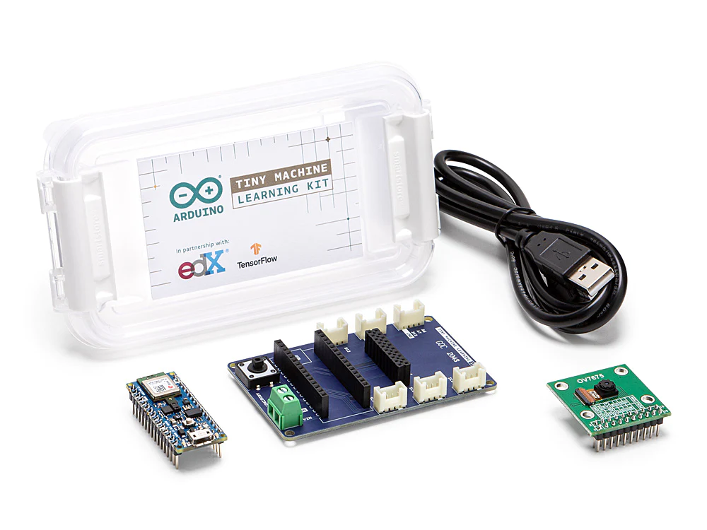

# Hand Gesture Recognition with TinyML

Project developed as part of the course _Hardware Architectures for Embedded and Edge AI_ at Politecnico di Milano during the academic year 2022–2023. It involves the development of a **Tiny Machine Learning (TinyML)** application that aims to deploy a Convolutional Neural Network (CNN) on the **Arduino Nano 33 BLE**, a tiny resource-constrained device. The application focuses on creating a **Hand Gesture Recognition (HGR)** system, which is a Machine Learning task and a sub-field of Computer Vision. The CNN is developed using the Transfer Learning paradigm and _MobileNetV1_ as a base model. The system can classify gestures performed by an individual and trigger specific actions in real time using the device's built-in low-power camera.

The contents of the repository are organized as follows:
- `arduino`: contains the code and the library required to deploy the model on the device
- `models`: contains the trained models in a Keras-compatible format
- `notebooks`: contains the Jupyter Notebooks used for the Exploratory Data Analysis, dataset pre-processing and quantization
- `reports`: contains the complete report of the project
- `weights`: contains the weights of MobileNetV1 used for Transfer Learning

The files `dataset.py`, `model.py`, and `train.py` contain helper functions and classes to manage the dataset, the model, and the training process, respectively. The training of the models is performed in the notebooks `all-gestures-model.ipynb`, `5-gestures-model.ipynb`, and `5-gestures-v2-model.ipynb`.

## Target device
The target device is the [Arduino Nano 33 BLE](https://store.arduino.cc/products/arduino-nano-33-ble), part of the [TinyML kit](https://store.arduino.cc/products/arduino-tiny-machine-learning-kit), which also includes a low-power OV7675 camera.

As for any other TinyML application, the main challenge of the project will be optimizing the model such that it fits into the main memory of the device, which is constrained to a mere 256 KB. This limitation concerns not only the model itself but also the input data, the storage required to store the intermediate feature maps of the network, and the libraries required for the device’s functionality.

## Dataset
The dataset used in this project is the [ASL dataset](https://www.kaggle.com/grassknoted/asl-alphabet), which contains images of the American Sign Language alphabet. The dataset is composed of 87000 images, each of which is 256x256 pixels and contains a single letter of the alphabet. The dataset is divided into 29 classes, corresponding to the 26 letters of the alphabet, and three additional classes for space, delete, and nothing. Although not originally intended for hand-gesture recognition, it is possible to consider the different letters of the sign language as if they were distinct gestures.

## Exploratory Data Analysis
In this section, the characteristics of the information contained in the dataset are analyzed. The goals of the EDA are the following:
- Check for inconsistencies in the data
- Check whether the class distribution is balanced
- Visualize a reduced-dimensional representation of the data
- Identify a subset of classes for model training

The data was found to be free of inconsistencies, and the class distribution was balanced. To select a subset of the gestures, feature extraction was performed on the images using the pre-trained CNN _EfficientNetV2B1_. Then, t-distributed Stochastic Neighbor Embedding (t-SNE) was applied to the extracted features to reduce the dimensionality and visualize the data. The following scatterplot shows the first two dimensions after t-SNE has been applied.

Unfortunately, the t-SNE plot does not show a clear separation between the classes, which makes it difficult to select a subset of gestures based on the visual representation. Therefore, the subset of gestures was decided based on the per-class error rate of a model trained on the entire dataset, which is called the _all-gestures model_.

## 5-gestures model 
This model is trained on the subset of gestures 'C', 'G', 'H', 'Q', 'space', and 'nothing'. The feature extractor consists of _MobileNetV1_ with $\alpha = 0.25$ pre-trained on the 96x96 version of the ImageNet dataset. _MobileNetV1_ was specifically designed for resource-constrained devices, and it is characterized by a very small memory footprint, making it the only viable choice due to the very limited amount of system memory available on the target device.  A dense classifier was developed and attached to the feature extractor, resulting in the following architecture:

After training and fine-tuning the model using the Adam optimizer and the Categorical Cross-Entropy loss, it was evaluated on the test set. The following confusion matrix showcases its performance:

## Quantization
Quantization is required to deploy the model on the target device. This process allows for minimizing the inference time, the dimension of the model, and the average RAM usage, while the performance of the model can remain approximately the same. The quantization step has been performed by applying **Post Training Quantization (PTQ)**. There are multiple ways to perform this operation, as shown in the table below:

The second technique leads to the highest performance. However, given that the Microcontroller (MCU) of the target device supports only full integer models, the third technique is selected. As expected, the quantized model performs slightly worse than the unoptimized one, but its accuracy is still very high nonetheless.

After the deployment on the device, the model was tested in real-time, with the hands of different individuals and using different backgrounds and lights. Its performance was found to be much lower than expected, with the model struggling to correctly classify all gestures. This issue is attributed to the limited variability in the dataset, which led to a search for another, more diverse dataset.

## 5-gestures-v2 model
The original dataset was enriched by using the [ASL Alphabet Test](https://www.kaggle.com/datasets/danrasband/asl-alphabet-test), which presents images with a very large diversity of lighting conditions and backgrounds; and by employing the low-power camera interfaced with the target device to capture new samples. The result is a dataset called _ASL Final_, which consists of 90 samples per class for a total of 540 labeled images.

Using this data, the same architecture used for the previous model is trained. To counteract the overfitting due to the small size of the dataset, the dropout rate of the Dropout layers is largely increased and extensive data augmentation techniques are used. Training and quantization were performed directly using the [Edge Impulse](https://www.edgeimpulse.com) framework. The following confusion matrix shows the performance of the model after full integer quantization:

## Deployment
To perform the deployment, the model was converted to a C++ file using Edge Impulse. The platform provides a library that allows the model to be run on the target device. To run a demo on the device, it is sufficient to upload the code on the device, select the correct serial port and open the serial monitor. Then, it will be possible to see the output of the device, which includes the prediction of the model and the confidence bound for each gesture.

## Setup
The project was developed using Python 3.10 and TensorFlow 2.13.0.

Clone the repository and then install all the required packages with:

    pip install -r requirements.txt

## Software
- [TensorFlow](https://www.tensorflow.org)
- [Edge Impulse](https://www.edgeimpulse.com)
- [Scikit-learn](https://scikit-learn.org/stable/index.html)
- [Matplotlib](https://matplotlib.org)
- [Plotly](https://plotly.com/python/)
- [Python](https://www.python.org/)
- [PyCharm](https://www.jetbrains.com/pycharm/)
- [Google Colab](https://colab.research.google.com/)

## License
Licensed under [MIT License](LICENSE)    